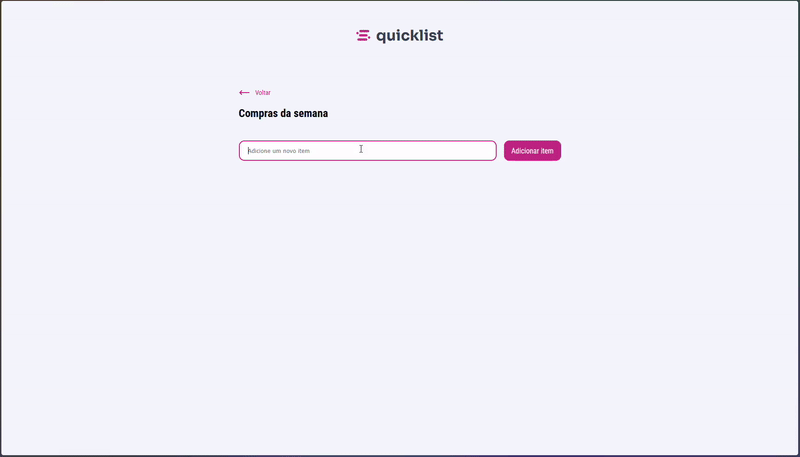

# Quicklist — Lista de Compras

Exercício de **lista de compras** em JavaScript vanilla (HTML, CSS e JS), feito no contexto dos estudos da RocketSeat.

## Sobre o projeto

**Quicklist** é uma aplicação web para gerenciar itens de "Compras da semana": adicionar novos itens e remover itens da lista. A interface usa tipografia Sora/Roboto Condensed e um tema em tons de rosa (#ca3884) e cinza.

## Demonstração

Coloque um GIF de demonstração (gravação de tela do app) em `assets/demo.gif` para exibir abaixo:



## Funcionalidades

- **Adicionar item:** digite no campo e clique em "Adicionar item" (ou envie o formulário).
- **Remover item:** clique no ícone de lixeira ao lado do item.
- **Checkbox:** cada item possui um checkbox (estado visual).
- **Toast de exclusão:** mensagem "O item foi removido da lista" (elemento presente no HTML/CSS).

## Tecnologias

- HTML5
- CSS3 (layout e estilização)
- JavaScript (DOM, formulário, eventos)
- Fontes: [Google Fonts](https://fonts.google.com/) — Sora, Roboto Condensed, Inter

## Como executar

1. Clone ou baixe o repositório.
2. Abra o arquivo `index.html` no navegador (duplo clique ou "Open with Live Server" no VS Code).

Não é necessário instalar dependências nem rodar servidor (funciona como arquivo estático).

## Estrutura do projeto

```
Lista-compras-js/
├── index.html      # Estrutura da página
├── style.css       # Estilos
├── script.js       # Lógica da lista (adicionar/remover itens)
├── assets/         # Imagens e ícones
│   ├── Logo.png
│   ├── move-left.svg
│   ├── trashIcon.png
│   ├── warningCircle-filled.png
│   ├── delete-small.png
│   └── demo.gif    # GIF de demonstração (adicione aqui)
└── README.md
```

## Licença

Uso livre para fins de estudo.
